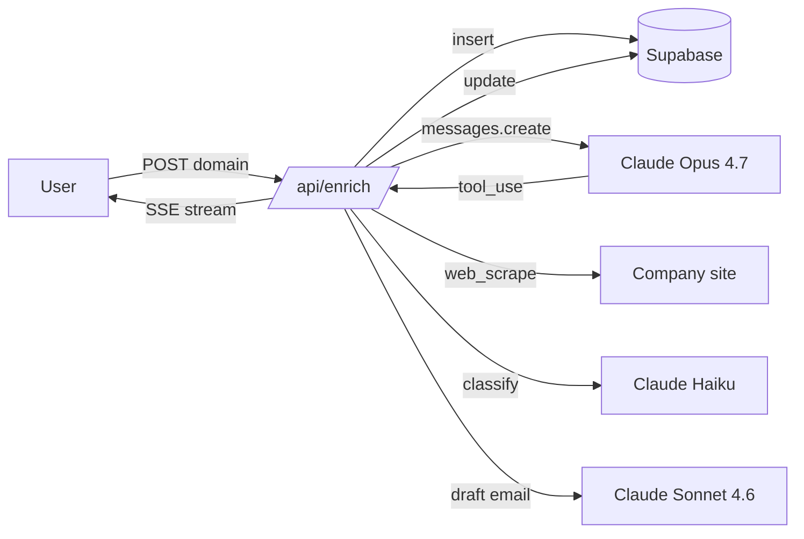

# Sales Intelligence Agent

Paste a domain. Watch an AI agent enrich the lead and draft the email.

A live demo of a Claude agent with tool use, streaming every tool call to the browser over Server-Sent Events.

<!-- screenshot here -->

## What this is

A Next.js app that runs an autonomous Claude agent loop. The user submits a company domain. The agent decides which tools to call (web scraping, classification, enrichment, email drafting), the route handler executes them, and every step is streamed to the UI in real time. The final output is a personalized cold email drafted from the enriched company profile.

## Live demo

[sales-intel.workfuelai.app](https://sales-intel.workfuelai.app)

## Tech stack

- Next.js 16 (App Router, React 19)
- TypeScript, Tailwind v4, shadcn/ui
- Anthropic SDK (`claude-opus-4-7` for the agent, `claude-haiku-4-5-20251001` for classification, `claude-sonnet-4-6` for email drafting)
- Supabase Postgres for run history and company cache
- Cheerio for HTML extraction
- Server-Sent Events over a Node runtime Route Handler

## Architecture



## Tools the agent can call

| Tool | Purpose |
| --- | --- |
| `web_scrape` | Fetch a URL, return title, description, body text (8k chars), nav links |
| `classify_company` | Claude Haiku call, returns industry, size, tech stack, pain points |
| `lookup_company_extras` | Heuristic enrichment for founded year, location, social links |
| `generate_outbound_email` | Claude Sonnet call, drafts a personalized cold email |
| `save_run` | Persists the final payload to Supabase and ends the loop |

A companion MCP server exposes the same tools to any MCP-compatible client (Claude Desktop, Cursor, etc.): [augusto-devingcc/company-intel-mcp](https://github.com/augusto-devingcc/company-intel-mcp).

## Local development

```bash
npm install
cp .env.example .env.local
# fill in ANTHROPIC_API_KEY and Supabase keys
npm run dev
```

Open `http://localhost:3000` and submit a domain.

The Supabase schema lives in `schema.sql`. Apply it once to your Supabase project (SQL editor or `psql`).

## Project layout

```
src/
  app/
    api/enrich/route.ts   # agent loop + SSE stream
    layout.tsx, page.tsx, globals.css
  components/
    enrich-experience.tsx # main client UI
    tool-step-card.tsx    # live tool call card
    email-card.tsx        # final email preview
    ui/                   # shadcn components
  lib/
    supabase-server.ts
    supabase-browser.ts
    tools/
      types.ts
      web-scrape.ts
      classify-company.ts
      lookup-extras.ts
      generate-email.ts
```

## SSE event types

| Event | Payload |
| --- | --- |
| `run_started` | `{ run_id, domain }` |
| `iteration` | `{ iteration, max }` |
| `assistant_text` | `{ text }` |
| `step_start` | `{ tool, args, iteration }` |
| `step_result` | `{ tool, result, duration_ms, is_error, iteration }` |
| `final` | `{ classification, generated_email, company_name, total_tokens, iterations }` |
| `error` | `{ message }` |

## Author

Built by Augusto Garcia. [github.com/augusto-devingcc](https://github.com/augusto-devingcc).
